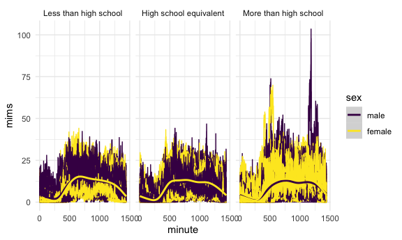
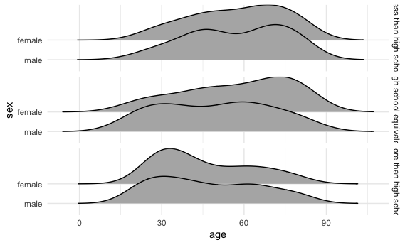

p8105_hw3_sdc2157
================
Stephanie Calluori
2023-10-14

``` r
library(tidyverse)
library(p8105.datasets)
library(patchwork)
library(ggridges)

data("instacart")

data("brfss_smart2010")

demographic_raw <- read_csv("data/nhanes_covar.csv", skip = 4, col_names = TRUE)
head(demographic_raw)
tail(demographic_raw)
colnames(demographic_raw)

accel_raw <- read_csv("data/nhanes_accel.csv", col_names = TRUE)
head(accel_raw)
tail(accel_raw)
colnames(accel_raw)
```

# Problem 1

``` r
instacart_clean <- instacart |> 
  janitor::clean_names()

head(instacart_clean)
```

    ## # A tibble: 6 × 15
    ##   order_id product_id add_to_cart_order reordered user_id eval_set order_number
    ##      <int>      <int>             <int>     <int>   <int> <chr>           <int>
    ## 1        1      49302                 1         1  112108 train               4
    ## 2        1      11109                 2         1  112108 train               4
    ## 3        1      10246                 3         0  112108 train               4
    ## 4        1      49683                 4         0  112108 train               4
    ## 5        1      43633                 5         1  112108 train               4
    ## 6        1      13176                 6         0  112108 train               4
    ## # ℹ 8 more variables: order_dow <int>, order_hour_of_day <int>,
    ## #   days_since_prior_order <int>, product_name <chr>, aisle_id <int>,
    ## #   department_id <int>, aisle <chr>, department <chr>

``` r
str(instacart_clean)
```

    ## tibble [1,384,617 × 15] (S3: tbl_df/tbl/data.frame)
    ##  $ order_id              : int [1:1384617] 1 1 1 1 1 1 1 1 36 36 ...
    ##  $ product_id            : int [1:1384617] 49302 11109 10246 49683 43633 13176 47209 22035 39612 19660 ...
    ##  $ add_to_cart_order     : int [1:1384617] 1 2 3 4 5 6 7 8 1 2 ...
    ##  $ reordered             : int [1:1384617] 1 1 0 0 1 0 0 1 0 1 ...
    ##  $ user_id               : int [1:1384617] 112108 112108 112108 112108 112108 112108 112108 112108 79431 79431 ...
    ##  $ eval_set              : chr [1:1384617] "train" "train" "train" "train" ...
    ##  $ order_number          : int [1:1384617] 4 4 4 4 4 4 4 4 23 23 ...
    ##  $ order_dow             : int [1:1384617] 4 4 4 4 4 4 4 4 6 6 ...
    ##  $ order_hour_of_day     : int [1:1384617] 10 10 10 10 10 10 10 10 18 18 ...
    ##  $ days_since_prior_order: int [1:1384617] 9 9 9 9 9 9 9 9 30 30 ...
    ##  $ product_name          : chr [1:1384617] "Bulgarian Yogurt" "Organic 4% Milk Fat Whole Milk Cottage Cheese" "Organic Celery Hearts" "Cucumber Kirby" ...
    ##  $ aisle_id              : int [1:1384617] 120 108 83 83 95 24 24 21 2 115 ...
    ##  $ department_id         : int [1:1384617] 16 16 4 4 15 4 4 16 16 7 ...
    ##  $ aisle                 : chr [1:1384617] "yogurt" "other creams cheeses" "fresh vegetables" "fresh vegetables" ...
    ##  $ department            : chr [1:1384617] "dairy eggs" "dairy eggs" "produce" "produce" ...
    ##  - attr(*, "spec")=
    ##   .. cols(
    ##   ..   order_id = col_integer(),
    ##   ..   product_id = col_integer(),
    ##   ..   add_to_cart_order = col_integer(),
    ##   ..   reordered = col_integer(),
    ##   ..   user_id = col_integer(),
    ##   ..   eval_set = col_character(),
    ##   ..   order_number = col_integer(),
    ##   ..   order_dow = col_integer(),
    ##   ..   order_hour_of_day = col_integer(),
    ##   ..   days_since_prior_order = col_integer(),
    ##   ..   product_name = col_character(),
    ##   ..   aisle_id = col_integer(),
    ##   ..   department_id = col_integer(),
    ##   ..   aisle = col_character(),
    ##   ..   department = col_character()
    ##   .. )

``` r
sum(is.na(instacart_clean))
```

    ## [1] 0

``` r
num_users <- instacart_clean |> 
  distinct(user_id)
```

The data set describes

The data set contains 1384617 observations and 15. Each observation
corresponds to a distinct instacart product. Variables include order_id,
product_id, add_to_cart_order, reordered, user_id, eval_set,
order_number, order_dow, order_hour_of_day, days_since_prior_order,
product_name, aisle_id, department_id, aisle, department.

``` r
num_aisle <- instacart_clean |> 
  count(aisle_id) |> 
  nrow()

aisle_items <- instacart_clean |> 
  select(aisle, product_name) |> 
  group_by(aisle) |> 
  summarize(
    n_items = n()
  ) |> 
  arrange(desc(n_items))
```

fresh veggies, fresh fruits, and packaged vegtables/fruits

``` r
plot <- aisle_items |> 
  filter(n_items > 10000) |> 
  ggplot(aes(x = aisle, y = n_items)) +
  geom_col()
```

Make a plot that shows the number of items ordered in each aisle,
limiting this to aisles with more than 10000 items ordered. Arrange
aisles sensibly, and organize your plot so others can read it.

``` r
pop_items <- instacart_clean |> 
  filter(aisle %in% c("baking ingredients", "dog food care", "packaged vegetables fruits")) |> 
  group_by(aisle, product_name) |> 
  summarize(n_obs = n()) |> 
  arrange(desc(n_obs)) |> 
  mutate(rank = min_rank(desc(n_obs))) |>
  filter(rank < 4) |> 
  knitr::kable(digits = 2)
```

    ## `summarise()` has grouped output by 'aisle'. You can override using the
    ## `.groups` argument.

Make a table showing the three most popular items in each of the aisles
“baking ingredients”, “dog food care”, and “packaged vegetables fruits”.
Include the number of times each item is ordered in your table.

``` r
sub <- instacart_clean |> 
  drop_na() |> 
  select(product_name, order_dow, order_hour_of_day) |> 
  filter(product_name %in% c("Pink Lady Apples", "Coffee Ice Cream")) |> 
  mutate(
    order_dow = recode(
      order_dow, 
      "0" = "Sunday",
      "1" = "Monday",
      "2" = "Tuesday",
      "3" = "Wednesday",
      "4" = "Thursday",
      "5" = "Friday",
      "6" = "Saturday"),
  ) |> 
  group_by(product_name, order_dow) |> 
  arrange(product_name) |> 
  summarize(avg_hr = mean(order_hour_of_day)) |> 
  pivot_wider(
    names_from = order_dow,
    values_from = avg_hr
  )
```

    ## `summarise()` has grouped output by 'product_name'. You can override using the
    ## `.groups` argument.

# Problem 2

50 states and Washington DC

``` r
brfss_clean <- brfss_smart2010 |> 
  janitor::clean_names() |> 
  rename(state = locationabbr, county = locationdesc) |> 
  filter(topic == "Overall Health", 
         response %in% c("Excellent", "Very good", "Good", "Fair", "Poor")) |> 
  mutate(response = fct_relevel(response, 
                                c("Poor", "Fair", "Good", "Very good", "Excellent")))

unique(brfss_clean$state)
```

    ##  [1] "AL" "AZ" "AR" "CA" "CO" "CT" "DE" "DC" "FL" "GA" "HI" "ID" "IL" "IN" "IA"
    ## [16] "KS" "LA" "KY" "ME" "MD" "MA" "MI" "MN" "MO" "MS" "MT" "NE" "NV" "NH" "NJ"
    ## [31] "NM" "NY" "NC" "ND" "OH" "OK" "OR" "PA" "RI" "SC" "SD" "TN" "TX" "UT" "VT"
    ## [46] "WA" "WI" "WV" "WY" "AK" "VA"

In 2002, which states were observed at 7 or more locations?

``` r
brfss_clean |> 
  select(year, state, county) |> 
  filter(year == "2002") |> 
  group_by(state) |> 
  distinct(county) |>
  summarize(num_county = n()) |> 
  filter(num_county >= 7) |> 
  arrange(desc(num_county)) |> 
  knitr::kable(digits = 2)
```

| state | num_county |
|:------|-----------:|
| PA    |         10 |
| MA    |          8 |
| NJ    |          8 |
| CT    |          7 |
| FL    |          7 |
| NC    |          7 |

In 2010, which states were observed at 7 or more locations?

``` r
brfss_clean |> 
  select(year, state, county) |> 
  filter(year == "2010") |> 
  group_by(state) |>
  distinct(county) |> 
  summarize(num_county = n()) |> 
  filter(num_county >= 7) |> 
  arrange(desc(num_county)) |> 
  knitr::kable(digits = 2)
```

| state | num_county |
|:------|-----------:|
| FL    |         41 |
| NJ    |         19 |
| TX    |         16 |
| CA    |         12 |
| MD    |         12 |
| NC    |         12 |
| NE    |         10 |
| WA    |         10 |
| MA    |          9 |
| NY    |          9 |
| OH    |          8 |
| CO    |          7 |
| PA    |          7 |
| SC    |          7 |

Construct a dataset that is limited to Excellent responses, and
contains, year, state, and a variable that averages the data_value
across locations within a state. Make a “spaghetti” plot of this average
value over time within a state (that is, make a plot showing a line for
each state across years – the geom_line geometry and group aesthetic
will help).

\###Office Hrs ASK ABOUT: strategies to make more readable, check on
group aesthetic?

``` r
brfss_clean |> 
  select(year, state, county, response, data_value) |>
  drop_na() |> 
  filter(response == "Excellent") |> 
  group_by(state, year) |> 
  summarize(avg_data_value = mean(data_value)) |> 
  ggplot(aes(x = year, y = avg_data_value, color = state)) +
  geom_line() 
```

    ## `summarise()` has grouped output by 'state'. You can override using the
    ## `.groups` argument.


Make a two-panel plot showing, for the years 2006, and 2010,
distribution of data_value for responses (“Poor” to “Excellent”) among
locations in NY State.

``` r
brfss_clean |> 
  select(year, state, response, data_value) |> 
  filter(year %in% c(2006, 2010), state == "NY") |> 
  mutate(response = fct_reorder(response, data_value)) |> 
  ggplot(aes(x = data_value, y = response)) +
  geom_density_ridges() +
  facet_grid(.~year)
```

    ## Picking joint bandwidth of 2.1

    ## Picking joint bandwidth of 2.03



\#Problem 3 demogrpahic raw accel raw

Load, tidy, merge, and otherwise organize the data sets. Your final
dataset should include all originally observed variables; exclude
participants less than 21 years of age, and those with missing
demographic data; and encode data with reasonable variable classes
(i.e. not numeric, and using factors with the ordering of tables and
plots in mind).

``` r
demographic_clean <- demographic_raw |> 
  janitor::clean_names() |> 
  mutate(sex = as.factor(sex),
         education = as.factor(education)
         ) |>
  mutate(sex = recode(sex, 
                      "1" = "male", 
                      "2" = "female"),
         education = recode(education, 
             "1" = "Less than high school",
             "2" = "High school equivalent",
             "3" = "More than high school")) |> 
  drop_na() |> 
  filter(age >= 21)

nrow(demographic_clean)
```

    ## [1] 228

``` r
accel_clean <- accel_raw |> 
  janitor::clean_names()

combined_accel <- left_join(demographic_clean, accel_clean, by = "seqn")
nrow(combined_accel)
```

    ## [1] 228

``` r
head(combined_accel)
```

    ## # A tibble: 6 × 1,445
    ##    seqn sex      age   bmi education  min1  min2  min3  min4   min5   min6  min7
    ##   <dbl> <fct>  <dbl> <dbl> <fct>     <dbl> <dbl> <dbl> <dbl>  <dbl>  <dbl> <dbl>
    ## 1 62161 male      22  23.3 High sch… 1.11  3.12  1.47  0.938 1.60   0.145  2.10 
    ## 2 62164 female    44  23.2 More tha… 1.92  1.67  2.38  0.935 2.59   5.22   2.39 
    ## 3 62169 male      21  20.1 High sch… 5.85  5.18  4.76  6.48  6.85   7.24   6.12 
    ## 4 62174 male      80  33.9 More tha… 5.42  3.48  3.72  3.81  6.85   4.45   0.561
    ## 5 62177 male      51  20.1 High sch… 6.14  8.06  9.99  6.60  4.57   2.78   7.10 
    ## 6 62178 male      80  28.5 High sch… 0.167 0.429 0.131 1.20  0.0796 0.0487 0.106
    ## # ℹ 1,433 more variables: min8 <dbl>, min9 <dbl>, min10 <dbl>, min11 <dbl>,
    ## #   min12 <dbl>, min13 <dbl>, min14 <dbl>, min15 <dbl>, min16 <dbl>,
    ## #   min17 <dbl>, min18 <dbl>, min19 <dbl>, min20 <dbl>, min21 <dbl>,
    ## #   min22 <dbl>, min23 <dbl>, min24 <dbl>, min25 <dbl>, min26 <dbl>,
    ## #   min27 <dbl>, min28 <dbl>, min29 <dbl>, min30 <dbl>, min31 <dbl>,
    ## #   min32 <dbl>, min33 <dbl>, min34 <dbl>, min35 <dbl>, min36 <dbl>,
    ## #   min37 <dbl>, min38 <dbl>, min39 <dbl>, min40 <dbl>, min41 <dbl>, …

Produce a reader-friendly table for the number of men and women in each
education category

``` r
combined_accel |> 
  group_by(education, sex) |> 
  summarize(n_obs = n()) |> 
  pivot_wider(
    names_from = sex,
    values_from = n_obs,
  ) |> 
  knitr::kable(digits = 2)
```

    ## `summarise()` has grouped output by 'education'. You can override using the
    ## `.groups` argument.

| education              | male | female |
|:-----------------------|-----:|-------:|
| Less than high school  |   27 |     28 |
| High school equivalent |   35 |     23 |
| More than high school  |   56 |     59 |

create a visualization of the age distributions for men and women in
each education category.

``` r
combined_accel |> 
  ggplot(aes(x = age, y = sex)) +
  geom_density_ridges() +
  facet_grid(. ~ education)
```

    ## Picking joint bandwidth of 7.91

    ## Picking joint bandwidth of 9.03

    ## Picking joint bandwidth of 7.15


``` r
combined_accel |> 
  ggplot(aes(x = age, y = sex)) +
  geom_density_ridges() +
  facet_grid(education ~ .)
```

    ## Picking joint bandwidth of 7.91

    ## Picking joint bandwidth of 9.03

    ## Picking joint bandwidth of 7.15



Traditional analyses of accelerometer data focus on the total activity
over the day. Using your tidied dataset, aggregate across minutes to
create a total activity variable for each participant. Plot these total
activities (y-axis) against age (x-axis); your plot should compare men
to women and have separate panels for each education level. Include a
trend line or a smooth to illustrate differences.

``` r
tail(colnames(combined_accel))
```

    ## [1] "min1435" "min1436" "min1437" "min1438" "min1439" "min1440"

``` r
combined_accel |>
  mutate(total_activity = rowSums(across(min1:min1440))) |> 
  ggplot(aes(x = age, y = total_activity, color = sex)) +
  geom_point() +
  geom_smooth(se=FALSE) +
  facet_grid(education ~ .)
```

    ## `geom_smooth()` using method = 'loess' and formula = 'y ~ x'


