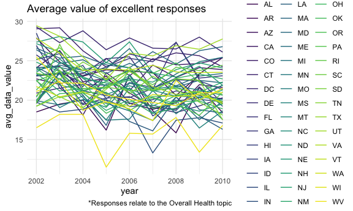
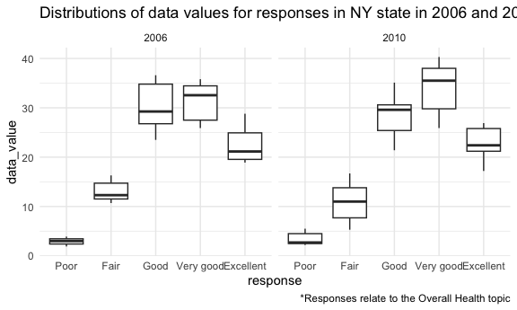
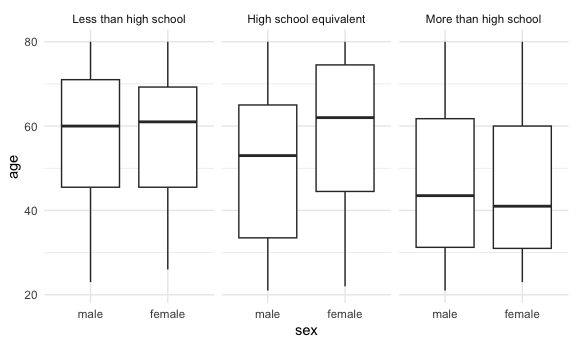
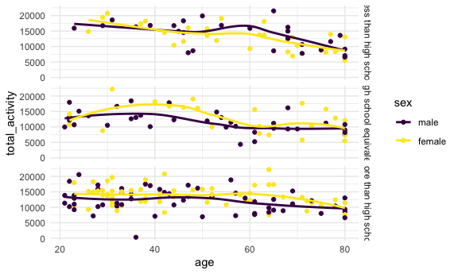

p8105_hw3_sdc2157
================
Stephanie Calluori
2023-10-14

# Load packages

``` r
library(tidyverse)
library(p8105.datasets)
library(ggridges)
```

# Data Import

``` r
data("instacart")

data("brfss_smart2010")

demographic_raw <- read_csv("data/nhanes_covar.csv", skip = 4, col_names = TRUE)
head(demographic_raw)
tail(demographic_raw)
colnames(demographic_raw)

accel_raw <- read_csv("data/nhanes_accel.csv", col_names = TRUE)
head(accel_raw)
tail(accel_raw)
colnames(accel_raw)
```

# Problem 1

``` r
instacart_clean <- instacart |> 
  janitor::clean_names()

na_num <- sum(is.na(instacart_clean))

popular_items <- instacart_clean |> 
  group_by(product_name) |> 
  summarize(product_n = n()) |> 
  arrange(desc(product_n))
```

The instacart data set contains 1384617 observations and 15 variables.
Each observation corresponds to a product from an order. There are
131209 orders from 131209 users (i.e., one order per user).

Variables include order_id, product_id, add_to_cart_order, reordered,
user_id, eval_set, order_number, order_dow, order_hour_of_day,
days_since_prior_order, product_name, aisle_id, department_id, aisle,
department. All variables are integers except for 4 character variables.
NA values are not present in the data set.

Across the orders, a total of 39123 distinct products were purchased.
The most purchased item was Banana.

``` r
num_aisle <- instacart_clean |> 
  count(aisle_id) |> 
  nrow()

aisle_items <- instacart_clean |> 
  group_by(aisle) |> 
  summarize(n_items = n()) |> 
  arrange(desc(n_items))
```

Customers ordered from 134 different aisles. The top 3 aisles from which
the most items are ordered are fresh vegetables, fresh fruits, and
packaged vegetables fruits.

``` r
aisle_items |> 
  filter(n_items > 10000) |> 
  mutate(aisle = forcats::fct_reorder(aisle, n_items, .desc = TRUE)) |> 
  ggplot(aes(x = aisle, y = n_items)) +
  geom_col() +
  labs(
    title = "Number of items ordered from each aisle",
    x = "Aisle",
    y = "Number of items",
    caption = "*Only includes aisles from which >10,000 items were ordered"
  ) +
  theme(axis.text.x = element_text(angle=45, vjust=1, hjust=1))
```


Following the top 3 aisles, yogurt, packaged cheese, and walter seltzer
sparkling water were the most popular aisles.

``` r
instacart_clean |> 
  filter(aisle %in% c("baking ingredients", "dog food care", "packaged vegetables fruits")) |> 
  group_by(aisle, product_name) |> 
  summarize(times_ordered = n()) |> 
  arrange(desc(times_ordered)) |> 
  mutate(rank = min_rank(desc(times_ordered))) |>
  filter(rank < 4) |> 
  knitr::kable(digits = 2)
```

    ## `summarise()` has grouped output by 'aisle'. You can override using the
    ## `.groups` argument.

| aisle                      | product_name                                  | times_ordered | rank |
|:---------------------------|:----------------------------------------------|--------------:|-----:|
| packaged vegetables fruits | Organic Baby Spinach                          |          9784 |    1 |
| packaged vegetables fruits | Organic Raspberries                           |          5546 |    2 |
| packaged vegetables fruits | Organic Blueberries                           |          4966 |    3 |
| baking ingredients         | Light Brown Sugar                             |           499 |    1 |
| baking ingredients         | Pure Baking Soda                              |           387 |    2 |
| baking ingredients         | Cane Sugar                                    |           336 |    3 |
| dog food care              | Snack Sticks Chicken & Rice Recipe Dog Treats |            30 |    1 |
| dog food care              | Organix Chicken & Brown Rice Recipe           |            28 |    2 |
| dog food care              | Small Dog Biscuits                            |            26 |    3 |

The top item ordered in the packaged vegetables fruits aisle was organic
baby spinach. In the baking ingredients aisle, light brown sugar was the
most ordered item. Small dog biscuits was the top item ordered in the
dog food care aisle.

``` r
instacart_clean |>
  filter(product_name %in% c("Pink Lady Apples", "Coffee Ice Cream")) |> 
  mutate(
    order_dow = recode(
      order_dow, 
      "0" = "Sunday",
      "1" = "Monday",
      "2" = "Tuesday",
      "3" = "Wednesday",
      "4" = "Thursday",
      "5" = "Friday",
      "6" = "Saturday"),
  ) |> 
  group_by(product_name, order_dow) |> 
  arrange(product_name) |> 
  summarize(avg_hr = mean(order_hour_of_day)) |> 
  pivot_wider(
    names_from = order_dow,
    values_from = avg_hr
  ) |>   
  select(product_name, Sunday, Monday, Tuesday, Wednesday, Thursday, Friday, Saturday) |> 
  knitr::kable(digits = 2)
```

    ## `summarise()` has grouped output by 'product_name'. You can override using the
    ## `.groups` argument.

| product_name     | Sunday | Monday | Tuesday | Wednesday | Thursday | Friday | Saturday |
|:-----------------|-------:|-------:|--------:|----------:|---------:|-------:|---------:|
| Coffee Ice Cream |  13.77 |  14.32 |   15.38 |     15.32 |    15.22 |  12.26 |    13.83 |
| Pink Lady Apples |  13.44 |  11.36 |   11.70 |     14.25 |    11.55 |  12.78 |    11.94 |

The table above shows the mean hour of the day at which Coffee Ice Cream
and Pink Lady Apples were ordered on each day of the week. Overall,
these items were typically ordered between late morning and
mid-afternoon, regardless of the day of the week.

# Problem 2

``` r
brfss_clean <- brfss_smart2010 |> 
  janitor::clean_names() |> 
  rename(state = locationabbr, county = locationdesc) |> 
  filter(topic == "Overall Health", 
         response %in% c("Excellent", "Very good", "Good", "Fair", "Poor")) |> 
  mutate(response = forcats::fct_relevel(response, 
                                c("Poor", "Fair", "Good", "Very good", "Excellent")))

state_num <- brfss_clean |> 
  distinct(state) |> 
  count()

unique(brfss_clean$state)

county_num <- brfss_clean |> 
  distinct(county) |> 
  count()
```

The cleaned brfss data set focusing on the topic of overall health
contains 10625 observations and 23 variables. These data were collected
from 404 counties across the 50 states and Washington, D.C. from 2002 to
2010.

The table below lists the states where 7 or more counties were surveyed
in 2002. Six states met this criteria. Pennsylvania was the highest with
10 counties surveyed.

``` r
brfss_clean |> 
  select(year, state, county) |> 
  filter(year == "2002") |> 
  group_by(state) |> 
  distinct(county) |>
  summarize(num_county = n()) |> 
  filter(num_county >= 7) |> 
  arrange(desc(num_county)) |> 
  knitr::kable(digits = 2)
```

| state | num_county |
|:------|-----------:|
| PA    |         10 |
| MA    |          8 |
| NJ    |          8 |
| CT    |          7 |
| FL    |          7 |
| NC    |          7 |

The table below lists the states where 7 or more counties were surveyed
in 2010. 14 states met this criteria. Florida was the highest with 41
counties surveyed.

``` r
brfss_clean |> 
  select(year, state, county) |> 
  filter(year == "2010") |> 
  group_by(state) |>
  distinct(county) |> 
  summarize(num_county = n()) |> 
  filter(num_county >= 7) |> 
  arrange(desc(num_county)) |> 
  knitr::kable(digits = 2)
```

| state | num_county |
|:------|-----------:|
| FL    |         41 |
| NJ    |         19 |
| TX    |         16 |
| CA    |         12 |
| MD    |         12 |
| NC    |         12 |
| NE    |         10 |
| WA    |         10 |
| MA    |          9 |
| NY    |          9 |
| OH    |          8 |
| CO    |          7 |
| PA    |          7 |
| SC    |          7 |

``` r
brfss_clean |> 
  select(year, state, county, response, data_value) |>
  drop_na() |> 
  filter(response == "Excellent") |> 
  group_by(state, year) |> 
  summarize(avg_data_value = mean(data_value)) |> 
  ggplot(aes(x = year, y = avg_data_value, group = state, color = state)) +
  geom_line() +
  labs(
    title = "Average value of excellent responses",
    caption = "*Responses relate to the Overall Health topic")
```

    ## `summarise()` has grouped output by 'state'. You can override using the
    ## `.groups` argument.



The figure above shows the average data value for excellent responses
across the 50 states and Washington, D.C. from 2002 to 2010. The
responses are in relation to the Overall Health topic. Some states show
great variability in the average data value for excellent responses
across this time period.

``` r
brfss_clean |> 
  select(year, state, response, data_value) |> 
  filter(year %in% c(2006, 2010), state == "NY") |> 
  ggplot(aes(x = response, y = data_value)) +
  geom_boxplot() +
  facet_grid(. ~ year) +
  labs(
    title = "Distributions of data values for responses in NY state in 2006 and 2010",
    caption = "*Responses relate to the Overall Health topic")
```



The figure above compares the distributions of data values for responses
“Poor” to “Excellent” among counties in NY state during 2006 to those
reported in 2010. The responses are in relation to the Overall Health
topic. Notably, the median data value for “Very good” responses was
greater in 2010 than 2006.

\#Problem 3

Load, tidy, merge, and otherwise organize the data sets. Your final
dataset should include all originally observed variables; exclude
participants less than 21 years of age, and those with missing
demographic data; and encode data with reasonable variable classes
(i.e. not numeric, and using factors with the ordering of tables and
plots in mind).

``` r
demographic_clean <- demographic_raw |> 
  janitor::clean_names() |> 
  mutate(sex = as.factor(sex),
         education = as.factor(education)
         ) |>
  mutate(sex = recode(sex, 
                      "1" = "male", 
                      "2" = "female"),
         education = recode(education, 
             "1" = "Less than high school",
             "2" = "High school equivalent",
             "3" = "More than high school")) |> 
  drop_na() |> 
  filter(age >= 21)

nrow(demographic_clean)
```

    ## [1] 228

``` r
accel_clean <- accel_raw |> 
  janitor::clean_names()

combined_accel <- left_join(demographic_clean, accel_clean, by = "seqn")
nrow(combined_accel)
```

    ## [1] 228

``` r
head(combined_accel)
```

    ## # A tibble: 6 × 1,445
    ##    seqn sex      age   bmi education  min1  min2  min3  min4   min5   min6  min7
    ##   <dbl> <fct>  <dbl> <dbl> <fct>     <dbl> <dbl> <dbl> <dbl>  <dbl>  <dbl> <dbl>
    ## 1 62161 male      22  23.3 High sch… 1.11  3.12  1.47  0.938 1.60   0.145  2.10 
    ## 2 62164 female    44  23.2 More tha… 1.92  1.67  2.38  0.935 2.59   5.22   2.39 
    ## 3 62169 male      21  20.1 High sch… 5.85  5.18  4.76  6.48  6.85   7.24   6.12 
    ## 4 62174 male      80  33.9 More tha… 5.42  3.48  3.72  3.81  6.85   4.45   0.561
    ## 5 62177 male      51  20.1 High sch… 6.14  8.06  9.99  6.60  4.57   2.78   7.10 
    ## 6 62178 male      80  28.5 High sch… 0.167 0.429 0.131 1.20  0.0796 0.0487 0.106
    ## # ℹ 1,433 more variables: min8 <dbl>, min9 <dbl>, min10 <dbl>, min11 <dbl>,
    ## #   min12 <dbl>, min13 <dbl>, min14 <dbl>, min15 <dbl>, min16 <dbl>,
    ## #   min17 <dbl>, min18 <dbl>, min19 <dbl>, min20 <dbl>, min21 <dbl>,
    ## #   min22 <dbl>, min23 <dbl>, min24 <dbl>, min25 <dbl>, min26 <dbl>,
    ## #   min27 <dbl>, min28 <dbl>, min29 <dbl>, min30 <dbl>, min31 <dbl>,
    ## #   min32 <dbl>, min33 <dbl>, min34 <dbl>, min35 <dbl>, min36 <dbl>,
    ## #   min37 <dbl>, min38 <dbl>, min39 <dbl>, min40 <dbl>, min41 <dbl>, …

Produce a reader-friendly table for the number of men and women in each
education category

``` r
combined_accel |> 
  group_by(education, sex) |> 
  summarize(n_obs = n()) |> 
  pivot_wider(
    names_from = sex,
    values_from = n_obs,
  ) |> 
  knitr::kable(digits = 2)
```

    ## `summarise()` has grouped output by 'education'. You can override using the
    ## `.groups` argument.

| education              | male | female |
|:-----------------------|-----:|-------:|
| Less than high school  |   27 |     28 |
| High school equivalent |   35 |     23 |
| More than high school  |   56 |     59 |

create a visualization of the age distributions for men and women in
each education category.

``` r
combined_accel |> 
  ggplot(aes(x = age, y = sex)) +
  geom_density_ridges() +
  facet_grid(. ~ education)
```

    ## Picking joint bandwidth of 7.91

    ## Picking joint bandwidth of 9.03

    ## Picking joint bandwidth of 7.15



``` r
combined_accel |> 
  ggplot(aes(x = age, y = sex)) +
  geom_density_ridges() +
  facet_grid(education ~ .)
```

    ## Picking joint bandwidth of 7.91

    ## Picking joint bandwidth of 9.03

    ## Picking joint bandwidth of 7.15


``` r
combined_accel |> 
  ggplot(aes(x = sex, y = age)) +
  geom_boxplot() +
  facet_grid(. ~ education)
```



Traditional analyses of accelerometer data focus on the total activity
over the day. Using your tidied dataset, aggregate across minutes to
create a total activity variable for each participant. Plot these total
activities (y-axis) against age (x-axis); your plot should compare men
to women and have separate panels for each education level. Include a
trend line or a smooth to illustrate differences.

``` r
tail(colnames(combined_accel))
```

    ## [1] "min1435" "min1436" "min1437" "min1438" "min1439" "min1440"

``` r
combined_accel |>
  mutate(total_activity = rowSums(across(min1:min1440))) |> 
  ggplot(aes(x = age, y = total_activity, color = sex)) +
  geom_point() +
  geom_smooth(se=FALSE) +
  facet_grid(education ~ .)
```

    ## `geom_smooth()` using method = 'loess' and formula = 'y ~ x'


Accelerometer data allows the inspection activity over the course of the
day. Make a three-panel plot that shows the 24-hour activity time
courses for each education level and use color to indicate sex. Describe
in words any patterns or conclusions you can make based on this graph;
including smooth trends may help identify differences.

when you group by seqn it calculate averages mims for each minute need
to convert minute to numeric so you get continous x axis

``` r
colnames(combined_accel)
```

    ##    [1] "seqn"      "sex"       "age"       "bmi"       "education" "min1"     
    ##    [7] "min2"      "min3"      "min4"      "min5"      "min6"      "min7"     
    ##   [13] "min8"      "min9"      "min10"     "min11"     "min12"     "min13"    
    ##   [19] "min14"     "min15"     "min16"     "min17"     "min18"     "min19"    
    ##   [25] "min20"     "min21"     "min22"     "min23"     "min24"     "min25"    
    ##   [31] "min26"     "min27"     "min28"     "min29"     "min30"     "min31"    
    ##   [37] "min32"     "min33"     "min34"     "min35"     "min36"     "min37"    
    ##   [43] "min38"     "min39"     "min40"     "min41"     "min42"     "min43"    
    ##   [49] "min44"     "min45"     "min46"     "min47"     "min48"     "min49"    
    ##   [55] "min50"     "min51"     "min52"     "min53"     "min54"     "min55"    
    ##   [61] "min56"     "min57"     "min58"     "min59"     "min60"     "min61"    
    ##   [67] "min62"     "min63"     "min64"     "min65"     "min66"     "min67"    
    ##   [73] "min68"     "min69"     "min70"     "min71"     "min72"     "min73"    
    ##   [79] "min74"     "min75"     "min76"     "min77"     "min78"     "min79"    
    ##   [85] "min80"     "min81"     "min82"     "min83"     "min84"     "min85"    
    ##   [91] "min86"     "min87"     "min88"     "min89"     "min90"     "min91"    
    ##   [97] "min92"     "min93"     "min94"     "min95"     "min96"     "min97"    
    ##  [103] "min98"     "min99"     "min100"    "min101"    "min102"    "min103"   
    ##  [109] "min104"    "min105"    "min106"    "min107"    "min108"    "min109"   
    ##  [115] "min110"    "min111"    "min112"    "min113"    "min114"    "min115"   
    ##  [121] "min116"    "min117"    "min118"    "min119"    "min120"    "min121"   
    ##  [127] "min122"    "min123"    "min124"    "min125"    "min126"    "min127"   
    ##  [133] "min128"    "min129"    "min130"    "min131"    "min132"    "min133"   
    ##  [139] "min134"    "min135"    "min136"    "min137"    "min138"    "min139"   
    ##  [145] "min140"    "min141"    "min142"    "min143"    "min144"    "min145"   
    ##  [151] "min146"    "min147"    "min148"    "min149"    "min150"    "min151"   
    ##  [157] "min152"    "min153"    "min154"    "min155"    "min156"    "min157"   
    ##  [163] "min158"    "min159"    "min160"    "min161"    "min162"    "min163"   
    ##  [169] "min164"    "min165"    "min166"    "min167"    "min168"    "min169"   
    ##  [175] "min170"    "min171"    "min172"    "min173"    "min174"    "min175"   
    ##  [181] "min176"    "min177"    "min178"    "min179"    "min180"    "min181"   
    ##  [187] "min182"    "min183"    "min184"    "min185"    "min186"    "min187"   
    ##  [193] "min188"    "min189"    "min190"    "min191"    "min192"    "min193"   
    ##  [199] "min194"    "min195"    "min196"    "min197"    "min198"    "min199"   
    ##  [205] "min200"    "min201"    "min202"    "min203"    "min204"    "min205"   
    ##  [211] "min206"    "min207"    "min208"    "min209"    "min210"    "min211"   
    ##  [217] "min212"    "min213"    "min214"    "min215"    "min216"    "min217"   
    ##  [223] "min218"    "min219"    "min220"    "min221"    "min222"    "min223"   
    ##  [229] "min224"    "min225"    "min226"    "min227"    "min228"    "min229"   
    ##  [235] "min230"    "min231"    "min232"    "min233"    "min234"    "min235"   
    ##  [241] "min236"    "min237"    "min238"    "min239"    "min240"    "min241"   
    ##  [247] "min242"    "min243"    "min244"    "min245"    "min246"    "min247"   
    ##  [253] "min248"    "min249"    "min250"    "min251"    "min252"    "min253"   
    ##  [259] "min254"    "min255"    "min256"    "min257"    "min258"    "min259"   
    ##  [265] "min260"    "min261"    "min262"    "min263"    "min264"    "min265"   
    ##  [271] "min266"    "min267"    "min268"    "min269"    "min270"    "min271"   
    ##  [277] "min272"    "min273"    "min274"    "min275"    "min276"    "min277"   
    ##  [283] "min278"    "min279"    "min280"    "min281"    "min282"    "min283"   
    ##  [289] "min284"    "min285"    "min286"    "min287"    "min288"    "min289"   
    ##  [295] "min290"    "min291"    "min292"    "min293"    "min294"    "min295"   
    ##  [301] "min296"    "min297"    "min298"    "min299"    "min300"    "min301"   
    ##  [307] "min302"    "min303"    "min304"    "min305"    "min306"    "min307"   
    ##  [313] "min308"    "min309"    "min310"    "min311"    "min312"    "min313"   
    ##  [319] "min314"    "min315"    "min316"    "min317"    "min318"    "min319"   
    ##  [325] "min320"    "min321"    "min322"    "min323"    "min324"    "min325"   
    ##  [331] "min326"    "min327"    "min328"    "min329"    "min330"    "min331"   
    ##  [337] "min332"    "min333"    "min334"    "min335"    "min336"    "min337"   
    ##  [343] "min338"    "min339"    "min340"    "min341"    "min342"    "min343"   
    ##  [349] "min344"    "min345"    "min346"    "min347"    "min348"    "min349"   
    ##  [355] "min350"    "min351"    "min352"    "min353"    "min354"    "min355"   
    ##  [361] "min356"    "min357"    "min358"    "min359"    "min360"    "min361"   
    ##  [367] "min362"    "min363"    "min364"    "min365"    "min366"    "min367"   
    ##  [373] "min368"    "min369"    "min370"    "min371"    "min372"    "min373"   
    ##  [379] "min374"    "min375"    "min376"    "min377"    "min378"    "min379"   
    ##  [385] "min380"    "min381"    "min382"    "min383"    "min384"    "min385"   
    ##  [391] "min386"    "min387"    "min388"    "min389"    "min390"    "min391"   
    ##  [397] "min392"    "min393"    "min394"    "min395"    "min396"    "min397"   
    ##  [403] "min398"    "min399"    "min400"    "min401"    "min402"    "min403"   
    ##  [409] "min404"    "min405"    "min406"    "min407"    "min408"    "min409"   
    ##  [415] "min410"    "min411"    "min412"    "min413"    "min414"    "min415"   
    ##  [421] "min416"    "min417"    "min418"    "min419"    "min420"    "min421"   
    ##  [427] "min422"    "min423"    "min424"    "min425"    "min426"    "min427"   
    ##  [433] "min428"    "min429"    "min430"    "min431"    "min432"    "min433"   
    ##  [439] "min434"    "min435"    "min436"    "min437"    "min438"    "min439"   
    ##  [445] "min440"    "min441"    "min442"    "min443"    "min444"    "min445"   
    ##  [451] "min446"    "min447"    "min448"    "min449"    "min450"    "min451"   
    ##  [457] "min452"    "min453"    "min454"    "min455"    "min456"    "min457"   
    ##  [463] "min458"    "min459"    "min460"    "min461"    "min462"    "min463"   
    ##  [469] "min464"    "min465"    "min466"    "min467"    "min468"    "min469"   
    ##  [475] "min470"    "min471"    "min472"    "min473"    "min474"    "min475"   
    ##  [481] "min476"    "min477"    "min478"    "min479"    "min480"    "min481"   
    ##  [487] "min482"    "min483"    "min484"    "min485"    "min486"    "min487"   
    ##  [493] "min488"    "min489"    "min490"    "min491"    "min492"    "min493"   
    ##  [499] "min494"    "min495"    "min496"    "min497"    "min498"    "min499"   
    ##  [505] "min500"    "min501"    "min502"    "min503"    "min504"    "min505"   
    ##  [511] "min506"    "min507"    "min508"    "min509"    "min510"    "min511"   
    ##  [517] "min512"    "min513"    "min514"    "min515"    "min516"    "min517"   
    ##  [523] "min518"    "min519"    "min520"    "min521"    "min522"    "min523"   
    ##  [529] "min524"    "min525"    "min526"    "min527"    "min528"    "min529"   
    ##  [535] "min530"    "min531"    "min532"    "min533"    "min534"    "min535"   
    ##  [541] "min536"    "min537"    "min538"    "min539"    "min540"    "min541"   
    ##  [547] "min542"    "min543"    "min544"    "min545"    "min546"    "min547"   
    ##  [553] "min548"    "min549"    "min550"    "min551"    "min552"    "min553"   
    ##  [559] "min554"    "min555"    "min556"    "min557"    "min558"    "min559"   
    ##  [565] "min560"    "min561"    "min562"    "min563"    "min564"    "min565"   
    ##  [571] "min566"    "min567"    "min568"    "min569"    "min570"    "min571"   
    ##  [577] "min572"    "min573"    "min574"    "min575"    "min576"    "min577"   
    ##  [583] "min578"    "min579"    "min580"    "min581"    "min582"    "min583"   
    ##  [589] "min584"    "min585"    "min586"    "min587"    "min588"    "min589"   
    ##  [595] "min590"    "min591"    "min592"    "min593"    "min594"    "min595"   
    ##  [601] "min596"    "min597"    "min598"    "min599"    "min600"    "min601"   
    ##  [607] "min602"    "min603"    "min604"    "min605"    "min606"    "min607"   
    ##  [613] "min608"    "min609"    "min610"    "min611"    "min612"    "min613"   
    ##  [619] "min614"    "min615"    "min616"    "min617"    "min618"    "min619"   
    ##  [625] "min620"    "min621"    "min622"    "min623"    "min624"    "min625"   
    ##  [631] "min626"    "min627"    "min628"    "min629"    "min630"    "min631"   
    ##  [637] "min632"    "min633"    "min634"    "min635"    "min636"    "min637"   
    ##  [643] "min638"    "min639"    "min640"    "min641"    "min642"    "min643"   
    ##  [649] "min644"    "min645"    "min646"    "min647"    "min648"    "min649"   
    ##  [655] "min650"    "min651"    "min652"    "min653"    "min654"    "min655"   
    ##  [661] "min656"    "min657"    "min658"    "min659"    "min660"    "min661"   
    ##  [667] "min662"    "min663"    "min664"    "min665"    "min666"    "min667"   
    ##  [673] "min668"    "min669"    "min670"    "min671"    "min672"    "min673"   
    ##  [679] "min674"    "min675"    "min676"    "min677"    "min678"    "min679"   
    ##  [685] "min680"    "min681"    "min682"    "min683"    "min684"    "min685"   
    ##  [691] "min686"    "min687"    "min688"    "min689"    "min690"    "min691"   
    ##  [697] "min692"    "min693"    "min694"    "min695"    "min696"    "min697"   
    ##  [703] "min698"    "min699"    "min700"    "min701"    "min702"    "min703"   
    ##  [709] "min704"    "min705"    "min706"    "min707"    "min708"    "min709"   
    ##  [715] "min710"    "min711"    "min712"    "min713"    "min714"    "min715"   
    ##  [721] "min716"    "min717"    "min718"    "min719"    "min720"    "min721"   
    ##  [727] "min722"    "min723"    "min724"    "min725"    "min726"    "min727"   
    ##  [733] "min728"    "min729"    "min730"    "min731"    "min732"    "min733"   
    ##  [739] "min734"    "min735"    "min736"    "min737"    "min738"    "min739"   
    ##  [745] "min740"    "min741"    "min742"    "min743"    "min744"    "min745"   
    ##  [751] "min746"    "min747"    "min748"    "min749"    "min750"    "min751"   
    ##  [757] "min752"    "min753"    "min754"    "min755"    "min756"    "min757"   
    ##  [763] "min758"    "min759"    "min760"    "min761"    "min762"    "min763"   
    ##  [769] "min764"    "min765"    "min766"    "min767"    "min768"    "min769"   
    ##  [775] "min770"    "min771"    "min772"    "min773"    "min774"    "min775"   
    ##  [781] "min776"    "min777"    "min778"    "min779"    "min780"    "min781"   
    ##  [787] "min782"    "min783"    "min784"    "min785"    "min786"    "min787"   
    ##  [793] "min788"    "min789"    "min790"    "min791"    "min792"    "min793"   
    ##  [799] "min794"    "min795"    "min796"    "min797"    "min798"    "min799"   
    ##  [805] "min800"    "min801"    "min802"    "min803"    "min804"    "min805"   
    ##  [811] "min806"    "min807"    "min808"    "min809"    "min810"    "min811"   
    ##  [817] "min812"    "min813"    "min814"    "min815"    "min816"    "min817"   
    ##  [823] "min818"    "min819"    "min820"    "min821"    "min822"    "min823"   
    ##  [829] "min824"    "min825"    "min826"    "min827"    "min828"    "min829"   
    ##  [835] "min830"    "min831"    "min832"    "min833"    "min834"    "min835"   
    ##  [841] "min836"    "min837"    "min838"    "min839"    "min840"    "min841"   
    ##  [847] "min842"    "min843"    "min844"    "min845"    "min846"    "min847"   
    ##  [853] "min848"    "min849"    "min850"    "min851"    "min852"    "min853"   
    ##  [859] "min854"    "min855"    "min856"    "min857"    "min858"    "min859"   
    ##  [865] "min860"    "min861"    "min862"    "min863"    "min864"    "min865"   
    ##  [871] "min866"    "min867"    "min868"    "min869"    "min870"    "min871"   
    ##  [877] "min872"    "min873"    "min874"    "min875"    "min876"    "min877"   
    ##  [883] "min878"    "min879"    "min880"    "min881"    "min882"    "min883"   
    ##  [889] "min884"    "min885"    "min886"    "min887"    "min888"    "min889"   
    ##  [895] "min890"    "min891"    "min892"    "min893"    "min894"    "min895"   
    ##  [901] "min896"    "min897"    "min898"    "min899"    "min900"    "min901"   
    ##  [907] "min902"    "min903"    "min904"    "min905"    "min906"    "min907"   
    ##  [913] "min908"    "min909"    "min910"    "min911"    "min912"    "min913"   
    ##  [919] "min914"    "min915"    "min916"    "min917"    "min918"    "min919"   
    ##  [925] "min920"    "min921"    "min922"    "min923"    "min924"    "min925"   
    ##  [931] "min926"    "min927"    "min928"    "min929"    "min930"    "min931"   
    ##  [937] "min932"    "min933"    "min934"    "min935"    "min936"    "min937"   
    ##  [943] "min938"    "min939"    "min940"    "min941"    "min942"    "min943"   
    ##  [949] "min944"    "min945"    "min946"    "min947"    "min948"    "min949"   
    ##  [955] "min950"    "min951"    "min952"    "min953"    "min954"    "min955"   
    ##  [961] "min956"    "min957"    "min958"    "min959"    "min960"    "min961"   
    ##  [967] "min962"    "min963"    "min964"    "min965"    "min966"    "min967"   
    ##  [973] "min968"    "min969"    "min970"    "min971"    "min972"    "min973"   
    ##  [979] "min974"    "min975"    "min976"    "min977"    "min978"    "min979"   
    ##  [985] "min980"    "min981"    "min982"    "min983"    "min984"    "min985"   
    ##  [991] "min986"    "min987"    "min988"    "min989"    "min990"    "min991"   
    ##  [997] "min992"    "min993"    "min994"    "min995"    "min996"    "min997"   
    ## [1003] "min998"    "min999"    "min1000"   "min1001"   "min1002"   "min1003"  
    ## [1009] "min1004"   "min1005"   "min1006"   "min1007"   "min1008"   "min1009"  
    ## [1015] "min1010"   "min1011"   "min1012"   "min1013"   "min1014"   "min1015"  
    ## [1021] "min1016"   "min1017"   "min1018"   "min1019"   "min1020"   "min1021"  
    ## [1027] "min1022"   "min1023"   "min1024"   "min1025"   "min1026"   "min1027"  
    ## [1033] "min1028"   "min1029"   "min1030"   "min1031"   "min1032"   "min1033"  
    ## [1039] "min1034"   "min1035"   "min1036"   "min1037"   "min1038"   "min1039"  
    ## [1045] "min1040"   "min1041"   "min1042"   "min1043"   "min1044"   "min1045"  
    ## [1051] "min1046"   "min1047"   "min1048"   "min1049"   "min1050"   "min1051"  
    ## [1057] "min1052"   "min1053"   "min1054"   "min1055"   "min1056"   "min1057"  
    ## [1063] "min1058"   "min1059"   "min1060"   "min1061"   "min1062"   "min1063"  
    ## [1069] "min1064"   "min1065"   "min1066"   "min1067"   "min1068"   "min1069"  
    ## [1075] "min1070"   "min1071"   "min1072"   "min1073"   "min1074"   "min1075"  
    ## [1081] "min1076"   "min1077"   "min1078"   "min1079"   "min1080"   "min1081"  
    ## [1087] "min1082"   "min1083"   "min1084"   "min1085"   "min1086"   "min1087"  
    ## [1093] "min1088"   "min1089"   "min1090"   "min1091"   "min1092"   "min1093"  
    ## [1099] "min1094"   "min1095"   "min1096"   "min1097"   "min1098"   "min1099"  
    ## [1105] "min1100"   "min1101"   "min1102"   "min1103"   "min1104"   "min1105"  
    ## [1111] "min1106"   "min1107"   "min1108"   "min1109"   "min1110"   "min1111"  
    ## [1117] "min1112"   "min1113"   "min1114"   "min1115"   "min1116"   "min1117"  
    ## [1123] "min1118"   "min1119"   "min1120"   "min1121"   "min1122"   "min1123"  
    ## [1129] "min1124"   "min1125"   "min1126"   "min1127"   "min1128"   "min1129"  
    ## [1135] "min1130"   "min1131"   "min1132"   "min1133"   "min1134"   "min1135"  
    ## [1141] "min1136"   "min1137"   "min1138"   "min1139"   "min1140"   "min1141"  
    ## [1147] "min1142"   "min1143"   "min1144"   "min1145"   "min1146"   "min1147"  
    ## [1153] "min1148"   "min1149"   "min1150"   "min1151"   "min1152"   "min1153"  
    ## [1159] "min1154"   "min1155"   "min1156"   "min1157"   "min1158"   "min1159"  
    ## [1165] "min1160"   "min1161"   "min1162"   "min1163"   "min1164"   "min1165"  
    ## [1171] "min1166"   "min1167"   "min1168"   "min1169"   "min1170"   "min1171"  
    ## [1177] "min1172"   "min1173"   "min1174"   "min1175"   "min1176"   "min1177"  
    ## [1183] "min1178"   "min1179"   "min1180"   "min1181"   "min1182"   "min1183"  
    ## [1189] "min1184"   "min1185"   "min1186"   "min1187"   "min1188"   "min1189"  
    ## [1195] "min1190"   "min1191"   "min1192"   "min1193"   "min1194"   "min1195"  
    ## [1201] "min1196"   "min1197"   "min1198"   "min1199"   "min1200"   "min1201"  
    ## [1207] "min1202"   "min1203"   "min1204"   "min1205"   "min1206"   "min1207"  
    ## [1213] "min1208"   "min1209"   "min1210"   "min1211"   "min1212"   "min1213"  
    ## [1219] "min1214"   "min1215"   "min1216"   "min1217"   "min1218"   "min1219"  
    ## [1225] "min1220"   "min1221"   "min1222"   "min1223"   "min1224"   "min1225"  
    ## [1231] "min1226"   "min1227"   "min1228"   "min1229"   "min1230"   "min1231"  
    ## [1237] "min1232"   "min1233"   "min1234"   "min1235"   "min1236"   "min1237"  
    ## [1243] "min1238"   "min1239"   "min1240"   "min1241"   "min1242"   "min1243"  
    ## [1249] "min1244"   "min1245"   "min1246"   "min1247"   "min1248"   "min1249"  
    ## [1255] "min1250"   "min1251"   "min1252"   "min1253"   "min1254"   "min1255"  
    ## [1261] "min1256"   "min1257"   "min1258"   "min1259"   "min1260"   "min1261"  
    ## [1267] "min1262"   "min1263"   "min1264"   "min1265"   "min1266"   "min1267"  
    ## [1273] "min1268"   "min1269"   "min1270"   "min1271"   "min1272"   "min1273"  
    ## [1279] "min1274"   "min1275"   "min1276"   "min1277"   "min1278"   "min1279"  
    ## [1285] "min1280"   "min1281"   "min1282"   "min1283"   "min1284"   "min1285"  
    ## [1291] "min1286"   "min1287"   "min1288"   "min1289"   "min1290"   "min1291"  
    ## [1297] "min1292"   "min1293"   "min1294"   "min1295"   "min1296"   "min1297"  
    ## [1303] "min1298"   "min1299"   "min1300"   "min1301"   "min1302"   "min1303"  
    ## [1309] "min1304"   "min1305"   "min1306"   "min1307"   "min1308"   "min1309"  
    ## [1315] "min1310"   "min1311"   "min1312"   "min1313"   "min1314"   "min1315"  
    ## [1321] "min1316"   "min1317"   "min1318"   "min1319"   "min1320"   "min1321"  
    ## [1327] "min1322"   "min1323"   "min1324"   "min1325"   "min1326"   "min1327"  
    ## [1333] "min1328"   "min1329"   "min1330"   "min1331"   "min1332"   "min1333"  
    ## [1339] "min1334"   "min1335"   "min1336"   "min1337"   "min1338"   "min1339"  
    ## [1345] "min1340"   "min1341"   "min1342"   "min1343"   "min1344"   "min1345"  
    ## [1351] "min1346"   "min1347"   "min1348"   "min1349"   "min1350"   "min1351"  
    ## [1357] "min1352"   "min1353"   "min1354"   "min1355"   "min1356"   "min1357"  
    ## [1363] "min1358"   "min1359"   "min1360"   "min1361"   "min1362"   "min1363"  
    ## [1369] "min1364"   "min1365"   "min1366"   "min1367"   "min1368"   "min1369"  
    ## [1375] "min1370"   "min1371"   "min1372"   "min1373"   "min1374"   "min1375"  
    ## [1381] "min1376"   "min1377"   "min1378"   "min1379"   "min1380"   "min1381"  
    ## [1387] "min1382"   "min1383"   "min1384"   "min1385"   "min1386"   "min1387"  
    ## [1393] "min1388"   "min1389"   "min1390"   "min1391"   "min1392"   "min1393"  
    ## [1399] "min1394"   "min1395"   "min1396"   "min1397"   "min1398"   "min1399"  
    ## [1405] "min1400"   "min1401"   "min1402"   "min1403"   "min1404"   "min1405"  
    ## [1411] "min1406"   "min1407"   "min1408"   "min1409"   "min1410"   "min1411"  
    ## [1417] "min1412"   "min1413"   "min1414"   "min1415"   "min1416"   "min1417"  
    ## [1423] "min1418"   "min1419"   "min1420"   "min1421"   "min1422"   "min1423"  
    ## [1429] "min1424"   "min1425"   "min1426"   "min1427"   "min1428"   "min1429"  
    ## [1435] "min1430"   "min1431"   "min1432"   "min1433"   "min1434"   "min1435"  
    ## [1441] "min1436"   "min1437"   "min1438"   "min1439"   "min1440"

``` r
str(combined_accel)
```

    ## tibble [228 × 1,445] (S3: tbl_df/tbl/data.frame)
    ##  $ seqn     : num [1:228] 62161 62164 62169 62174 62177 ...
    ##  $ sex      : Factor w/ 2 levels "male","female": 1 2 1 1 1 1 1 1 2 1 ...
    ##  $ age      : num [1:228] 22 44 21 80 51 80 35 26 30 57 ...
    ##  $ bmi      : num [1:228] 23.3 23.2 20.1 33.9 20.1 28.5 27.9 22.1 22.4 28 ...
    ##  $ education: Factor w/ 3 levels "Less than high school",..: 2 3 2 3 2 2 3 2 3 3 ...
    ##  $ min1     : num [1:228] 1.11 1.92 5.85 5.42 6.14 ...
    ##  $ min2     : num [1:228] 3.12 1.67 5.18 3.48 8.06 ...
    ##  $ min3     : num [1:228] 1.47 2.38 4.76 3.72 9.99 ...
    ##  $ min4     : num [1:228] 0.938 0.935 6.482 3.808 6.598 ...
    ##  $ min5     : num [1:228] 1.6 2.59 6.85 6.85 4.57 ...
    ##  $ min6     : num [1:228] 0.145 5.221 7.242 4.449 2.783 ...
    ##  $ min7     : num [1:228] 2.1 2.393 6.115 0.561 7.104 ...
    ##  $ min8     : num [1:228] 0.509 4.902 7.484 1.608 7.253 ...
    ##  $ min9     : num [1:228] 1.632 1.968 5.471 0.698 10.127 ...
    ##  $ min10    : num [1:228] 1.2 3.13 6.49 2.72 7.49 ...
    ##  $ min11    : num [1:228] 0.947 2.771 5.135 4.845 2.718 ...
    ##  $ min12    : num [1:228] 0.0263 2.4539 3.5134 0.5777 2.3941 ...
    ##  $ min13    : num [1:228] 0.0552 2.1964 5.4329 1.174 2.2013 ...
    ##  $ min14    : num [1:228] 0.037 3.079 3.836 2.801 0.85 ...
    ##  $ min15    : num [1:228] 2.1 7.72 10.22 1.06 3.3 ...
    ##  $ min16    : num [1:228] 0.543 9.464 6.942 0.029 2.918 ...
    ##  $ min17    : num [1:228] 0.0915 6.8507 5.9619 0.9488 3.6746 ...
    ##  $ min18    : num [1:228] 0.971 5.503 8.163 2.676 7.594 ...
    ##  $ min19    : num [1:228] 0.814 6.11 14.2 4.881 6.248 ...
    ##  $ min20    : num [1:228] 0.965 3.443 8.693 0.127 5.79 ...
    ##  $ min21    : num [1:228] 0.0478 3.5679 25.992 2.5968 3.3457 ...
    ##  $ min22    : num [1:228] 1.86 1.47 9.24 5.02 3.32 ...
    ##  $ min23    : num [1:228] 1.08 3.1 6.63 1.65 3.01 ...
    ##  $ min24    : num [1:228] 1.03 1.77 5.1 5.26 4.18 ...
    ##  $ min25    : num [1:228] 1.23 3.28 4.78 4.72 2.24 ...
    ##  $ min26    : num [1:228] 2.29 4.53 8.48 5.02 3.79 ...
    ##  $ min27    : num [1:228] 0.0607 2.5034 7.4079 4.7187 5.7221 ...
    ##  $ min28    : num [1:228] 0.0533 1.3331 4.4674 6.8562 5.5306 ...
    ##  $ min29    : num [1:228] 0.103 0.765 5.384 2.806 12.468 ...
    ##  $ min30    : num [1:228] 0.0907 5.9849 3.7921 4.3602 5.6324 ...
    ##  $ min31    : num [1:228] 0.309 3.25 5.987 3.357 1.305 ...
    ##  $ min32    : num [1:228] 0.401 0.745 4.218 1.742 2.748 ...
    ##  $ min33    : num [1:228] 1.234 0.99 3.491 1.998 0.395 ...
    ##  $ min34    : num [1:228] 0.033 1.342 3.624 0.98 1.554 ...
    ##  $ min35    : num [1:228] 3.0613 3.5911 5.953 0.0155 0.6207 ...
    ##  $ min36    : num [1:228] 1.723 5.063 7.598 0.457 0.247 ...
    ##  $ min37    : num [1:228] 0.0605 4.642 7.6967 0.6662 1.5099 ...
    ##  $ min38    : num [1:228] 4.22 5.02 6.34 1.05 1.69 ...
    ##  $ min39    : num [1:228] 0.805 2.664 20.129 0.02 3.07 ...
    ##  $ min40    : num [1:228] 0.898 1.363 10.044 0.507 4.033 ...
    ##  $ min41    : num [1:228] 1.7445 2.4273 4.4081 0.0427 2.1993 ...
    ##  $ min42    : num [1:228] 1.506 5.165 8.664 0.756 0.69 ...
    ##  $ min43    : num [1:228] 0.857 6.527 10.432 1.763 1.255 ...
    ##  $ min44    : num [1:228] 1.03 3.22 6.75 3.29 3.02 ...
    ##  $ min45    : num [1:228] 0.0495 6.4894 3.8894 0.0893 2.7264 ...
    ##  $ min46    : num [1:228] 0.137 6.602 3.976 0.732 7.687 ...
    ##  $ min47    : num [1:228] 0.911 2.535 3.47 1.363 1.78 ...
    ##  $ min48    : num [1:228] 0.299 3.532 5.168 0.117 1.399 ...
    ##  $ min49    : num [1:228] 0.364 2.365 5.692 0.759 1.329 ...
    ##  $ min50    : num [1:228] 0.0455 1.0396 5.194 0.5965 3.2546 ...
    ##  $ min51    : num [1:228] 0.0307 0.805 3.5296 0.419 2.827 ...
    ##  $ min52    : num [1:228] 2.216 0.722 6.174 0.147 2.251 ...
    ##  $ min53    : num [1:228] 0.0577 1.1586 7.8921 1.7413 0.3917 ...
    ##  $ min54    : num [1:228] 1.216 1.243 7.589 2.286 0.631 ...
    ##  $ min55    : num [1:228] 0.0765 1.2767 6.3474 4.3313 0.7009 ...
    ##  $ min56    : num [1:228] 0.0638 1.2551 5.1994 0.1208 1 ...
    ##  $ min57    : num [1:228] 0.532 0.6137 5.814 0.0183 2.2229 ...
    ##  $ min58    : num [1:228] 0.0448 0.7019 8.0919 0.698 3.5767 ...
    ##  $ min59    : num [1:228] 0.094 4.954 6.623 0.084 2.911 ...
    ##  $ min60    : num [1:228] 0.0273 4.0599 5.9017 0.5968 5.567 ...
    ##  $ min61    : num [1:228] 0.922 9.251 6.438 0.015 2.355 ...
    ##  $ min62    : num [1:228] 0.0378 2.8973 6.4271 0.0157 4.0069 ...
    ##  $ min63    : num [1:228] 0.15 1.871 5.103 0.183 3.47 ...
    ##  $ min64    : num [1:228] 0.0922 1.1697 5.1356 0.7497 2.7854 ...
    ##  $ min65    : num [1:228] 0.378 2.625 4.541 0.031 5.24 ...
    ##  $ min66    : num [1:228] 0.0377 2.476 5.7209 0.0307 4.8513 ...
    ##  $ min67    : num [1:228] 1.1283 2.3359 4.7034 0.0422 3.4093 ...
    ##  $ min68    : num [1:228] 0.123 4.983 6.667 0.873 4.443 ...
    ##  $ min69    : num [1:228] 1.21 3.26 5.61 5.84 7.37 ...
    ##  $ min70    : num [1:228] 0.0503 4.6211 3.496 6.2575 2.9409 ...
    ##  $ min71    : num [1:228] 0.0243 3.8281 3.5521 4.0658 3.1709 ...
    ##  $ min72    : num [1:228] 0.0543 2.0437 6.0114 4.9895 3.302 ...
    ##  $ min73    : num [1:228] 0.0273 1.0824 4.949 0.4662 10.2747 ...
    ##  $ min74    : num [1:228] 0.68 6.02 5.52 1.11 1.14 ...
    ##  $ min75    : num [1:228] 0.0512 5.1124 5.4481 6.5372 2.0353 ...
    ##  $ min76    : num [1:228] 0.747 7.646 6.168 5.703 2.457 ...
    ##  $ min77    : num [1:228] 0.743 6.181 5.776 0.41 1.793 ...
    ##  $ min78    : num [1:228] 1.26 4.77 10.52 1.04 3.82 ...
    ##  $ min79    : num [1:228] 0.854 4.373 7.089 0.359 3.331 ...
    ##  $ min80    : num [1:228] 1.166 4.56 7.959 0.931 4.177 ...
    ##  $ min81    : num [1:228] 0.206 1.921 7.116 0.237 5.08 ...
    ##  $ min82    : num [1:228] 0.824 2.648 4.855 1.529 2.02 ...
    ##  $ min83    : num [1:228] 0.115 2.168 7.518 5.599 5.898 ...
    ##  $ min84    : num [1:228] 1.06 1.32 9.21 3.2 3.3 ...
    ##  $ min85    : num [1:228] 3.76 2.75 5.03 3.3 1.23 ...
    ##  $ min86    : num [1:228] 6.86 1.85 4.4 2.96 6.24 ...
    ##  $ min87    : num [1:228] 5.949 1.477 9.568 0.033 0.89 ...
    ##  $ min88    : num [1:228] 1.593 0.715 9.112 0.394 0.815 ...
    ##  $ min89    : num [1:228] 0.353 1.552 9.95 1.137 0.102 ...
    ##  $ min90    : num [1:228] 0.768 1.583 9.702 0.212 1.515 ...
    ##  $ min91    : num [1:228] 0.275 1.4 4.508 0.527 4.04 ...
    ##  $ min92    : num [1:228] 0.0292 3.4963 7.5771 2.1612 2.8986 ...
    ##  $ min93    : num [1:228] 1.992 0.976 12.136 3.366 1.785 ...
    ##  $ min94    : num [1:228] 0.0522 3.4009 13.8067 0.1887 0.539 ...
    ##   [list output truncated]

``` r
combined_accel |> 
  pivot_longer(
    min1:min1440,
    names_to = "minute",
    names_prefix = "min",
    values_to = "mims"
  ) |> 
  mutate(minute = as.numeric(minute)) |> 
  ggplot(aes(x = minute, y = mims, group = seqn, color = sex)) +
  geom_line() +
  geom_smooth(aes(group = sex)) +
  facet_grid(. ~ education)
```

    ## `geom_smooth()` using method = 'gam' and formula = 'y ~ s(x, bs = "cs")'


try using boxplots!!!!
